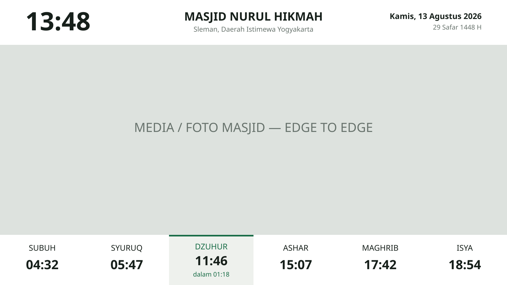
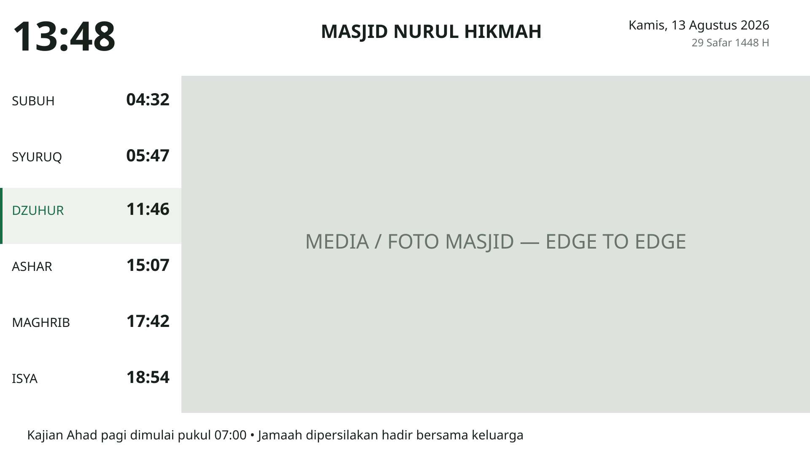
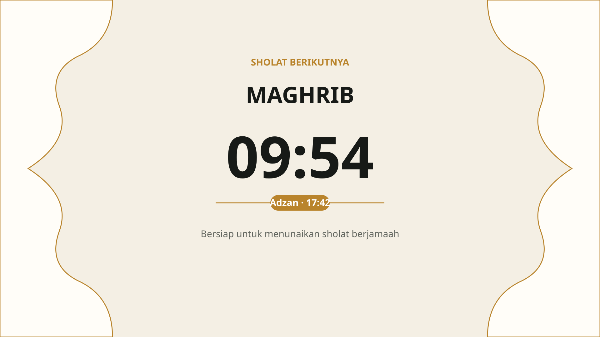
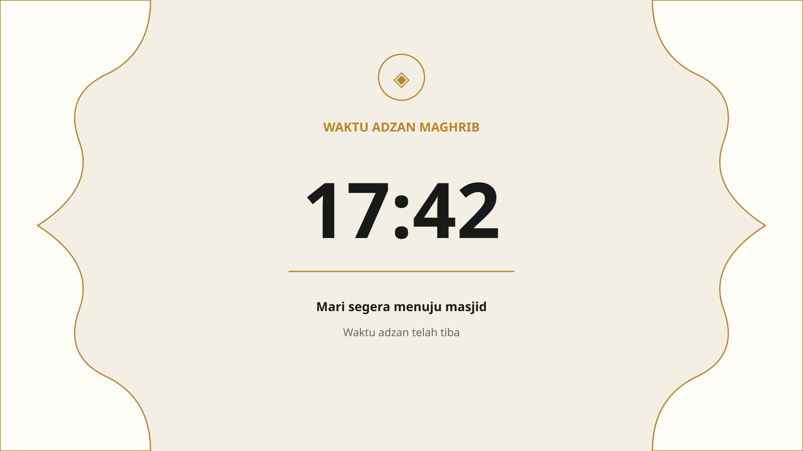
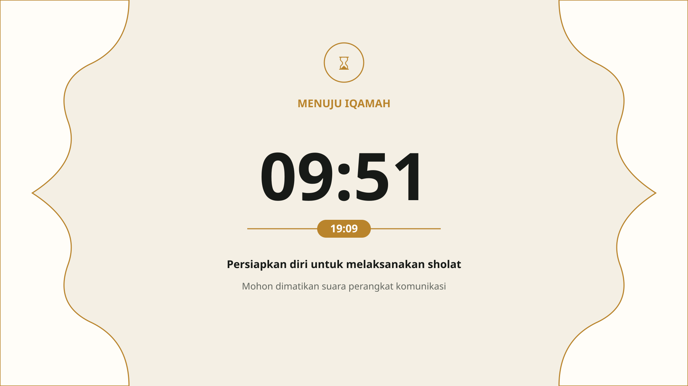
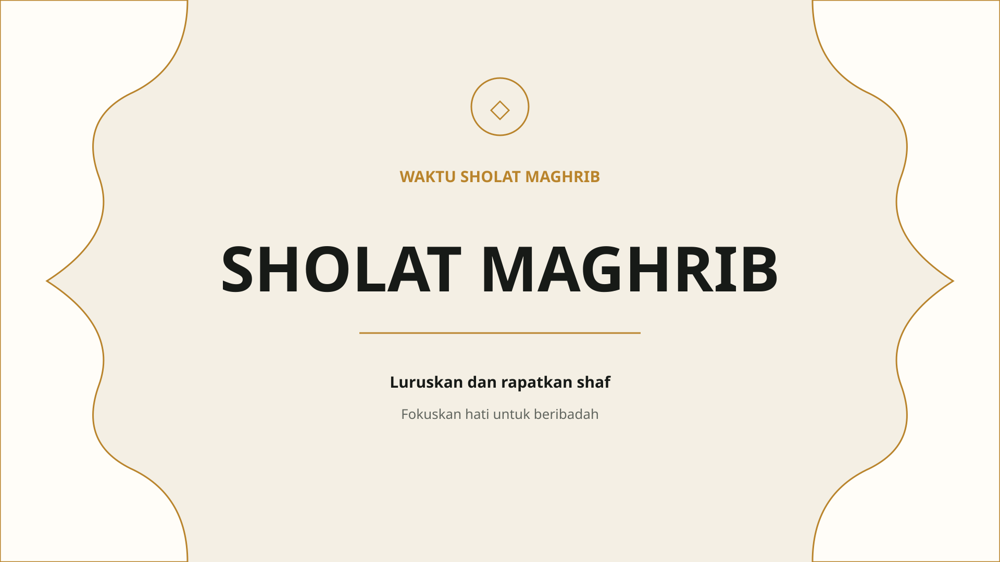
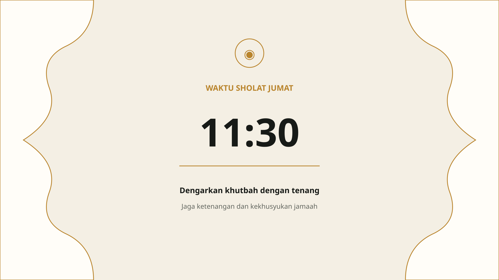
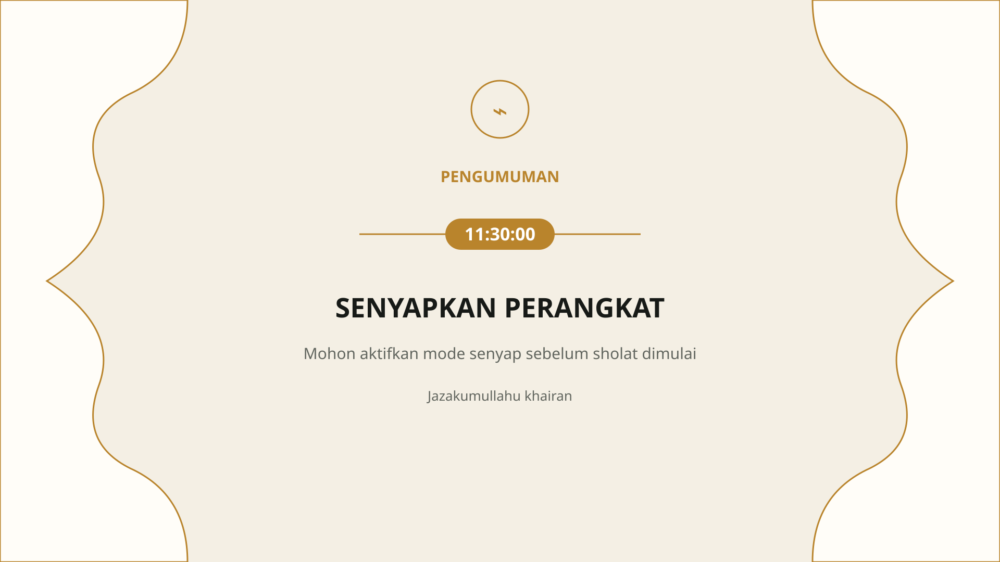

# Masjid Display — TV UI Preview

> Visual checkpoint per-screen untuk implementasi TV berdasarkan SSOT. Setiap gambar berdiri sendiri agar manusia maupun LLM tidak salah membaca beberapa state sebagai satu layar. `05-UI-TV.md` dan `09-UI-DESIGN-SYSTEM.md` tetap normative source of truth.

## 1. NORMAL — Horizontal Media

**Esensi:** header 170dp, media edge-to-edge mengambil sisa area, PrayerBar 190dp dengan tepat 6 cell. Hanya satu prayer boleh highlighted dan countdown hanya muncul pada cell tersebut.

## 2. NORMAL — Sidebar Media

**Esensi:** sidebar 430dp, header 180dp, enam prayer row equal-height, media edge-to-edge di kanan, InformationBar 100dp full-width di bawah.

## 3. FOCUS — Approaching

**Esensi:** light warm cream, accent gold, negative space besar. Hierarchy: state label → prayer → countdown → waktu adzan → reminder. Countdown tidak boleh negatif.

## 4. FOCUS — Adhan

**Esensi:** waktu adzan menjadi focal point. Tidak ada prayer table, media, ticker, atau elemen NORMAL lain yang mengganggu.

## 5. FOCUS — Iqamah

**Esensi:** countdown iqamah menjadi focal point, disertai reminder persiapan. Countdown tidak boleh negatif.

## 6. FOCUS — Prayer

**Esensi:** state sholat dibuat tenang dan minimal. Tidak menampilkan countdown/jam sebagai focal point; fokus pada status ibadah dan pesan singkat.

## 7. FOCUS — Friday

**Esensi:** grammar visual sama dengan focus state lain, tetapi copy khusus Jumat/khutbah. Hindari informasi sekunder yang tidak dibutuhkan.

## 8. FOCUS — Notice

**Esensi:** satu pengumuman penting dengan hierarchy sangat jelas. Waktu hanya ditampilkan bila memang relevan terhadap notice.

## Bahasa visual yang dikunci

- Light mode sebagai default visual TV.
- Background focus `#F4EFE4`, surface `#FFFDF8`, text `#171A17`, secondary `#62665F`, accent gold `#B9842C`.
- Ornamen Islam/arsitektural bersifat subtle; tidak boleh mengalahkan informasi.
- Typography modern, high-legibility, dan tabular numerals untuk waktu/countdown.
- Frame/accent tipis; hindari gold outline tebal dan dekorasi berlebihan.
- Negative space besar pada seluruh focus state.
- Target baseline `1920 × 1080 (16:9)`.
- Highlight tidak boleh menyebabkan layout jump.

## Aturan penggunaan visual

Setiap file di `docs/assets/ui/` merepresentasikan **satu screen/state**, bukan poster gabungan. Coding agent harus membuka gambar yang sesuai dengan screen yang sedang dikerjakan lalu membaca SSOT tekstual terkait. Jangan menggabungkan seluruh preview menjadi satu UI aplikasi.

Visual ini adalah mockup original Masjid Display berdasarkan pola desain yang telah disepakati. Nama masjid dan data contoh bersifat fiktif/original dan tidak menggunakan identitas produk referensi.
